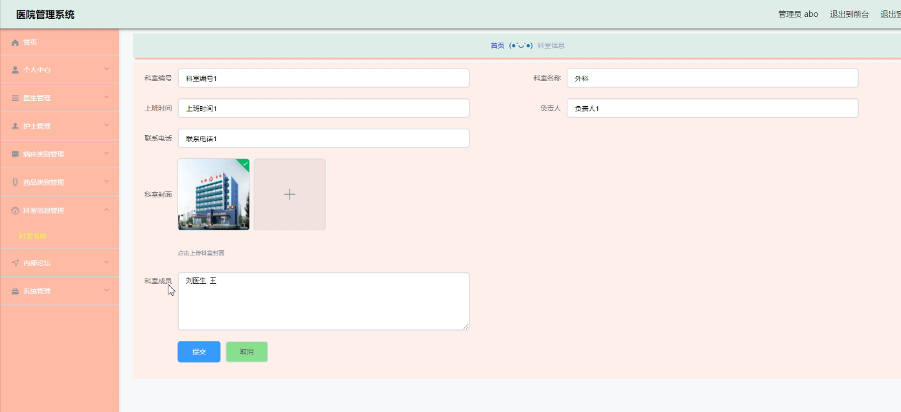

基于Springboot的医院管理系统
=
### 完整代码获取地址：从戎源码网 ([https://armycodes.com/](https://armycodes.com/))
### 作者微信：19941326836  QQ：952045282 
### 承接计算机毕业设计、Java毕业设计、Python毕业设计、深度学习、机器学习
### 选题+开题报告+任务书+程序定制+安装调试+论文+答辩ppt 一条龙服务
### 所有选题地址https://github.com/nature924/allProject

一、项目介绍
---
系统包含两种角色：用户、管理员，系统分为前台和后台两大模块，主要功能如下：

### 1 医生模块的实现
- 病床信息管理: 医生可以对病床信息进行添加、修改和删除操作。

- 药房信息管理: 医生可以对药房信息进行添加、修改和删除操作。

### 2 护士模块的实现
- 个人中心管理: 护士可以对个人中心中的信息进行修改操作。

- 药房信息: 护士可以查看药房信息，并进行查询操作。

### 3 管理员模块的实现
- 病床类别: 管理员可以对病床类别进行添加、修改、查询和删除操作。

- 科室信息管理: 管理员可以对科室信息进行添加、修改、查询和删除操作。

二、项目技术
---
- 编程语言：Java
- 数据库：MySQL
- 项目管理工具：Maven
- 前端技术：VUE、HTML、Jquery、Bootstrap
- 后端技术：Spring、SpringMVC、MyBatis

三、运行环境
---
- 操作系统：Windows、macOS都可以
- JDK版本：JDK1.8以上都可以
- 开发工具：IDEA、Ecplise、Myecplise都可以
- 数据库: MySQL5.7以上都可以
- Tomcat：任意版本都可以
- Maven：任意版本都可以

四、运行截图
---

### 程序截图：

